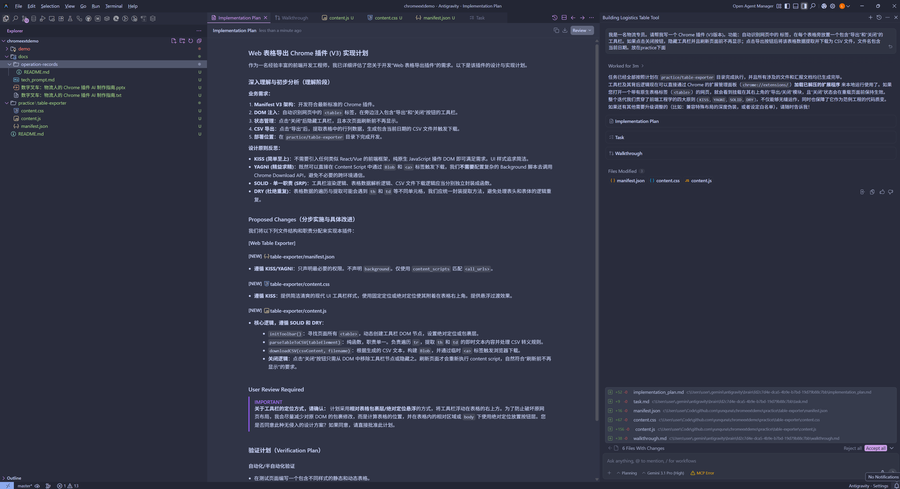
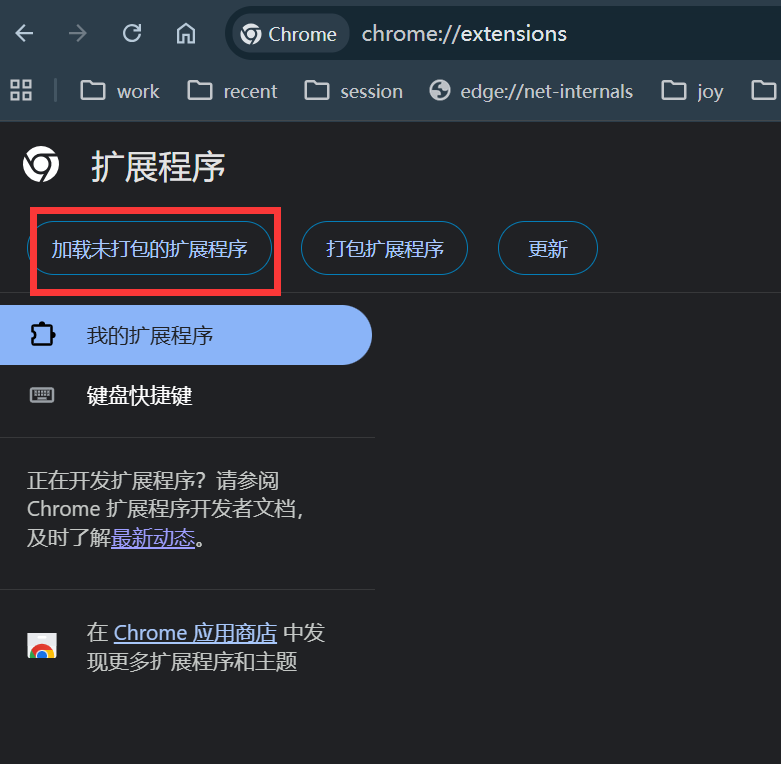
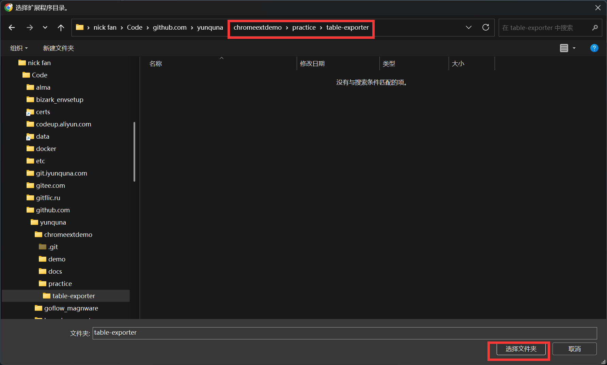
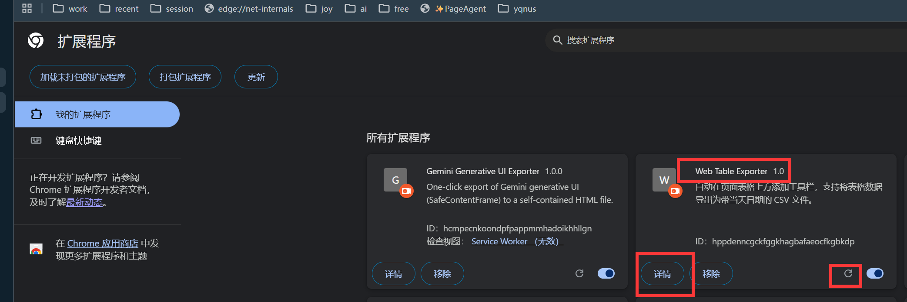
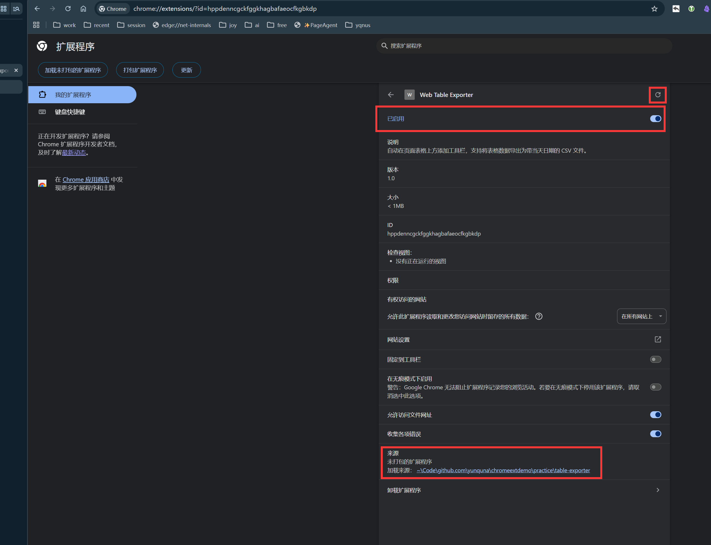
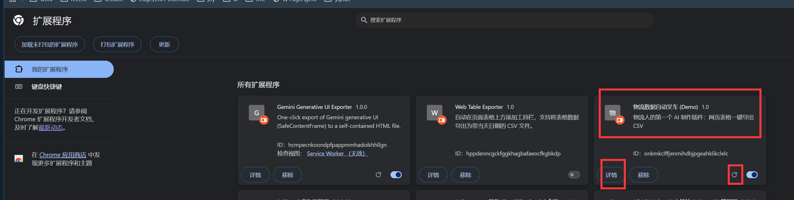
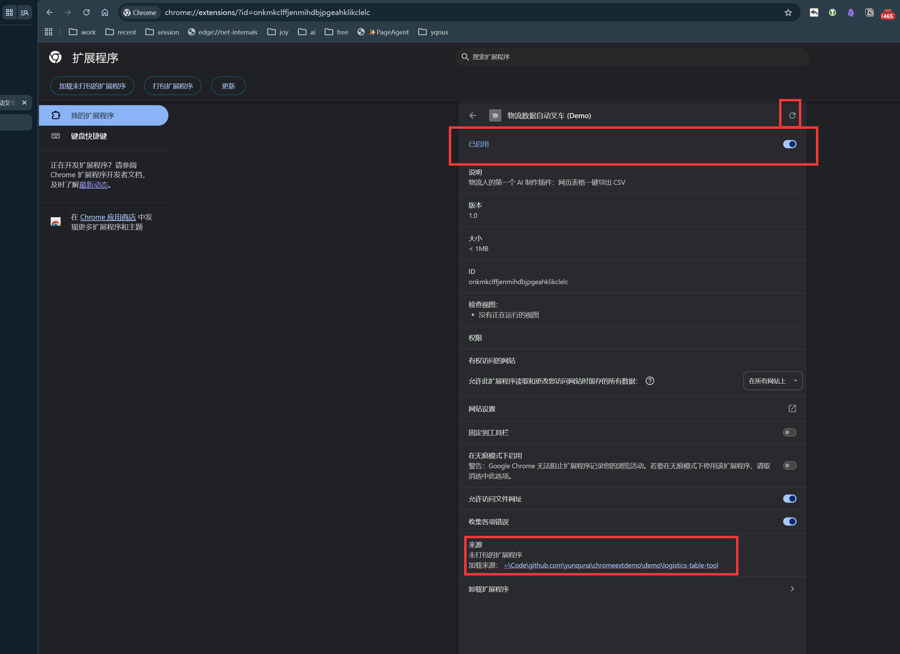
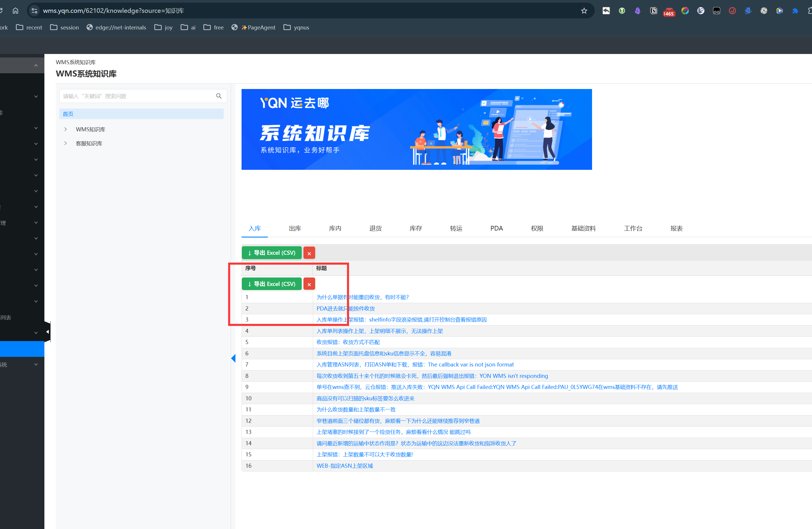

# 操作记录与演示指南

这份文档结合我们提供的 [`demo`](../../demo) 示例和您实际测试生成的 [`practice`](../../practice) 插件，详细演示了 Chrome 插件从开发、安装到实操使用的全流程记录。

代码仓库地址：<https://github.com/yunquna/chromeextdemo>

幻灯片地址：<https://docs.google.com/presentation/d/1C4R3fGoNyp8jGjcE6TbyYkgnBz4h49OWB-XeUNh5zfs/edit?usp=sharing>

---

## 🛠️ 第一步：实操开发 (开发)
在实际开发中，我们可以利用预设的提示词（Tech Prompt）指导大语言模型（如 Claude 或 Gemini）为我们快速生成基础的插件脚本。这其中包括了清单文件 `manifest.json`、逻辑脚本 `content.js` 以及样式表 `content.css`。

---

## 🧩 第二步：安装与载入插件 (安装)
在代码开发完成后，插件是以文件夹的形式存在的（如项目中的 `practice/table-exporter/`）。我们需要将其载入到 Chrome 浏览器中进行本地调试。

1. 在 Chrome 浏览器地址栏输入扩展程序管理地址：`chrome://extensions/`
   
   
2. 确保页面右上角的 **开发者模式 (Developer mode)** 处于开启状态。
3. 点击左上角的 **加载已解压的扩展程序 (Load unpacked)**。
   
   
4. 在弹出的本地文件选择窗口中，选中您的插件所在目录（例如 `practice/table-exporter/` 或 `demo/logistics-table-tool/`）。
5. 载入成功后，您的扩展面板中将展示出“数字叉车”或“Web 表格导出工具”的卡片，代表插件已就绪。
   
   
6. *(可选)* 您可以点击浏览器右上角的拼图图标，将该插件“固定”到工具栏，方便观察其状态。
   

---

## 📊 第三步：实地测试与使用 (使用)
插件载入后，它会在后台静默待命。让我们找一个存在大量表格数据的物流知识库页面进行测试。

1. **进入目标测试页面：**
   比如访问我们的运去哪 WMS 知识库进行测试：<https://wms.yqn.com/62102/knowledge?source=%E7%9F%A5%E8%AF%86%E5%BA%93>
   

2. **自动注入工具栏：**
   插件的 `content.js` 会自动扫描此网页中的 `<table>` 标签。在页面表格边缘（右上角），您将看到自动弹出的 **导出 CSV** 与 **关闭** 辅助按钮。如果您觉得干扰业务流，可以随时点击“关闭”暂时藏匿。
   

3. **一键提取与下载：**
   点击 **导出 CSV**。插件将立即把表格内的数据打包成结构化的文件格式（包含 UTF-8 BOM 防止乱码），并无缝触发自动下载。您可以看到浏览器下载了一份带有当天日期的 `.csv` 数据报表。
   下载的文件您可以直接使用 Excel 打开或导入，当然文本编辑器也可以秒开，非常规整。
   

> **🎉 恭喜！您已经成功掌握了利用 AI 辅助生成的专属物流浏览器插件的工作流。**
